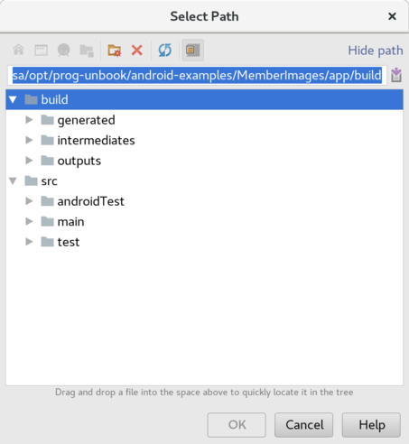
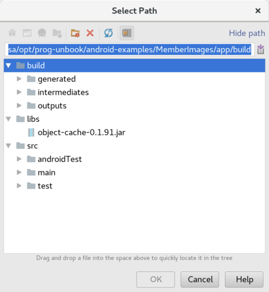

# Using Object Cache in Android

This short guide shows you how to use Object Cache in Android

# Setting things up

## Download Object Cache

Go to (Object Cache)[https://github.com/progund/object-cache] and click releases. Aim for the latest jar file (of the latest release) and download it. We download using ```curl``` so:

~~~
$ cd tmp
$ curl -LJO https://github.com/progund/object-cache/releases/download/0.1/object-cache-0.1.91.jar
  % Total    % Received % Xferd  Average Speed   Time    Time     Time  Current
                                 Dload  Upload   Total   Spent    Left  Speed
100   614    0   614    0     0    737      0 --:--:-- --:--:-- --:--:--   737
100  7874  100  7874    0     0   4851      0  0:00:01  0:00:01 --:--:-- 20775
curl: Saved to filename 'object-cache-0.1.91.jar'
~~~

## Copy the jar file to your Android project

First go to your Android Project folder. Let's say you have a project called MemberViewer. Then you should:

* enter (most likely) ```/home/hesa/AndroidStudioProjects/MemberViewer```
* create a directory called ```libs``` in the ```app``` directory (libs is a sub directory to app)
* finally copy the jar file to this directory

Something like this:

~~~
$ cd /home/hesa/AndroidStudioProjects/MemberViewer
$ mkdir app/libs
$ cp /tmp/object-cache-0.1.91.jar app/libs/
~~~

## Use the jar file to your Android project

### Manually

Add:
~~~
    // Added for ObjectCache support
    implementation files('libs/object-cache-0.1.91.jar')
~~~

in the ```dependencies``` section of the ```build.gradle``` file in your app folder (```app/build.gradle```).

### Using Android Studio

First steps :
* Click the ```File``` menu
* Click the ```Project structure```
* Click the ```app``` (underneath Modules)
* Click the ```dependencis``` tab
* Click the ```+``` sign and choose ```Jar dependency```
You should now see something like:

* Add the file by opening a file explorer* and drag the jar file to the newly opened window.

* Double click the jar file in the window and then click ```OK```.
* Click ```File``` and then click ```Sync with file system```
* Click ```Build``` and then click ```Clean Project```
* Click ```Build``` and then click ```Rebuild Project```

*File explorer examples: Nautilus or similar in GNU/Linux, Explorer in Windows and Finder in MacOS.*

## Using ObjectCache in your code

Let's continue with the <code>Member</code> class we used in the
general README. For simplicity we're going to let an
<code>Activity</code> use the cache. Perhaps it would be wiser to use some kind of dedicatd storage class to do this but we're not discussin OOAD here so let the <code>Activity</code> do the job.

### Import the classes

~~~
import se.juneday.ObjectCache;
import se.juneday.android.AndroidObjectCacheHelper;
import se.juneday.android.AndroidObjectCacheHelper.AndroidObjectCacheHelperException;
~~~

### Declare an instance variable

~~~
  // ObjectCache
  private ObjectCache<Member> cache;
~~~

### Initialize and use the cache

~~~
  @Override
  protected void onCreate(Bundle savedInstanceState) {
    super.onCreate(savedInstanceState);
    setContentView(R.layout.activity_volley);

    String fileName = null;
    try {
      fileName = AndroidObjectCacheHelper.objectCacheFileName(this, Member.class);
    } catch (AndroidObjectCacheHelperException e) {
      e.printStackTrace();
    }
    cache = new ObjectCache<>(fileName);
    members = (List<Member>) cache.readObjects();
    Log.d(LOG_TAG, "cache:  reading objects: " + members.size());
  }
~~~

### Store objects in the cache

~~~
   // ObjectCache
   Log.d(LOG_TAG, "cache: Storing objects: " + members.size()a);
   cache.storeObjects(members);
~~~

### What will happen

First time you run your app there's no data in the cache (surprise...not!) so you'll get a List with 0 elements in it. 

If you store some elements in the cache you will get them back net time you start the app.


